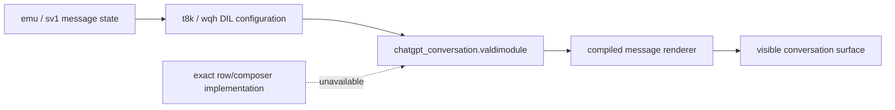

# Component dependency map and feature traces

## Classification

- **A — isolated/adaptable:** a clear boundary exists and the behavior is reasonably portable.
- **B — adaptable with a deliberate port/adapter:** useful logic is visible, but platform or framework coupling is material.
- **C — coupled to the original client/backend/account:** direct reuse would carry proprietary runtime, protocol, or credential assumptions.
- **D — unresolved:** the available artifact does not expose enough implementation to judge.

## Summary map

| Area | Classification | Evidence status |
|---|---:|---|
| Bootstrap | B | MainActivity/MainApplication and Valdi assets confirmed |
| Chat rendering | C/D | DIL/Valdi boundary confirmed; renderer internals unknown |
| Streaming response handling | B/C | Coordinator/state machine confirmed; transport/auth boundary unknown |
| Composer state | B/D | Mutation path confirmed; active UI callback semantics unknown |
| Conversation persistence | B/C | Repository/cache/query boundary confirmed; storage details unknown |
| Attachments | C | Upload registry and state replacement confirmed; protocol unknown |
| Voice architecture | C/D | API and multiple transports confirmed; selection/gating/runtime unknown |

## Feature trace 1 — bootstrap and shell

Entry point: manifest `com.openai.chatgpt.MainActivity` and `com.openai.chatgpt.app.MainApplication`.

`MainActivity.onCreate()`, `onNewIntent()`, and `onResume()` call the activity’s `n()` path. `MainApplication.onCreate()` registers application initialization/lifecycle behavior. The manifest names the application and activity, while Valdi module assets supply cross-platform feature surfaces.

Boundary: Android lifecycle → Valdi/DIL root → feature modules and native services.

Unknown: the full `n()` initialization graph and feature-flag/account bootstrap are not recovered in readable form.

## Feature trace 2 — chat rendering

Entry point: the conversation Valdi surface exposed through `chatgpt_conversation.valdimodule`.

Relevant components: `defpackage/t8k.java` constructs DIL message metadata and rendering/action objects; `defpackage/wqh.java` defines a widget configuration schema containing message metadata, render metrics, render composition, action handlers, and supported client actions; `emu`/`sv1`/`jw1` carry message/content state.

State flow: coordinator/message-model update → DIL/Valdi widget input → compiled renderer → visible message composition.

Boundary: readable Java model/coordinator objects stop at a Valdi-marshalled/render-composition boundary. The ordinary message row, markdown, tool/widget, animation, and scroll implementation is in compiled assets.

Unknown: exact component names, item diffing strategy, partial-token repaint policy, markdown renderer, and composer-to-renderer callback mapping.

## Feature trace 3 — streaming response handling

Entry point: `defpackage/xgf.java`, `q0()` at line 1679, with the `ConversationCoordinator/streamConversation` label at line 1733.

State flow:

1. `p0()` constructs request/turn context (`ConversationCoordinator/createRequest`, line 1562).
2. `q0()` launches `xef` for streaming.
3. `xef.invokeSuspend()` creates/tracks `d890`/`u790` state around lines 203–450.
4. `vef.a(tlg, m4f)` applies typed stream events and integrates `emu` around lines 33–1075.
5. `xgf.g0()` handles a messages-complete boundary; `xgf.j0()` handles a stream-done boundary.
6. `xgf.H0()` and `blg` guard saved-state/active-stream transitions.
7. `ConversationStreamingService` supplies sticky service lifetime and the 1,200,000 ms failsafe.

Networking boundary: the readable code provides a stream source/callback and request construction, but the exact HTTP/SSE/WebSocket implementation, endpoint, headers, and authenticated payload are not proven.

Confirmed: an incremental, typed, per-turn state machine with distinct terminal paths.

Unknown/not tested: real token arrival, ordering under reconnect, resume semantics, tool/widget event rendering, and server error mapping in a live account session.

## Feature trace 4 — composer state

Entry point: Valdi conversation surface; the recoverable Android-side mutation path is `defpackage/hlx.java` plus `xgf.N0()`.

State flow: a composer/action callback produces an `hlx` mutation → `hlx` creates/merges an `emu` message/content item → `xgf.N0()` builds an updated `f5f`, checks content IDs, and schedules `ConversationCoordinator/writeMessagesToDb` → request/stream path proceeds through `P0()`/`p0()`.

Boundary: composer UI callback and input method behavior are in the Valdi surface or obfuscated glue; persistence and request handoff are visible in Java.

Confirmed: typed message/content vocabulary and a message mutation/persistence boundary.

Inferred: the composer is modeled as actions/mutations rather than a direct database write.

Unknown/not tested: debounce, IME behavior, send-button enablement, edit/regenerate/stop semantics, drafts, and mapping from text change to `hlx`.

## Feature trace 5 — conversation persistence

Entry point: `xgf.N0()` at line 6449.

State flow: updated `f5f` aggregate → coroutine labeled `ConversationCoordinator/writeMessagesToDb` at line 6800 → `s9g` repository → `hyh` cache and `q4d` complete-conversation query/serialization layer.

`q4d` explicitly parses `system_hints`, `pending_attachment_placeholders`, and `pending_attachment_upload_ids`. This is direct evidence that incomplete attachment state can be represented in a persisted conversation record.

Boundary: `s9g` exposes repository operations, but the underlying storage driver/schema/key handling is not fully legible.

Confirmed: staged repository/cache/query path.

Unknown/not tested: actual tables, migrations, encryption, transaction isolation, sync conflict resolution, and cross-device history merge.

## Feature trace 6 — attachments

Entry point: picker boundary `com.openai.valdi.filepicker.FilePickerService` / `FilePickerSource`; coordinator message state in `emu.p0` and `hlx`.

State flow: picker URI/content selection → `emu` attachment/content references → `s6f` URI-keyed upload registry → `qgf` awaits upload/result → `CHATGPT_FILE_UPLOAD_STEP_STATUS_STARTED`/`SUCCEEDED`/`FAILED` → matching `emu` replacement → `xgf.P0()` and persistence.

Confirmed: message association, asynchronous upload result handling, telemetry stages, and persisted pending placeholders.

Unknown/not tested: multipart/body schema, endpoint, authentication headers, server attachment IDs, retry/cancel policy, MIME/size failures, picker UI, and actual upload.

## Feature trace 7 — voice architecture

Entry point: Valdi `VoiceService.getCapabilities()` and `start(VoiceSessionInput, VoiceSessionListener)`.

State flow: Valdi input/mode → `cy0` selects implementation/transport → `mu0` realtime audio (`AudioRecord`/`AudioTrack`/effects), `sq0` bridge path, or `zp0` dictation path → transcript/status/error callbacks. `co6` supplies an HTTP `/backend-api/transcribe` branch. `VoiceModeForegroundService` and `VoiceAudioRecordingUploadWorker` extend background lifecycle.

Confirmed: API contract, callback vocabulary, audio resource ownership, transcription boundary, foreground service, and worker inputs.

Unknown/not tested: account gating, capability flags under a real configuration, signaling endpoint/codec, exact audio format, screen-share coupling, microphone permission flow, and recording upload behavior.

## Overall dependency conclusion

The coordinator and data models are the most valuable static references. The renderer/composer are the least directly portable because they terminate in compiled Valdi assets. Attachments and voice have explicit boundaries but remain coupled to account/backend contracts. An independent provider-neutral client is therefore lower risk than trying to substitute a provider inside the official binary.
