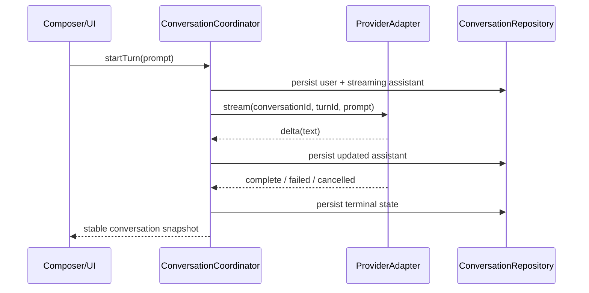

# Provider-boundary feasibility

## Recovered official-client boundary

The official client’s request path is visible in `defpackage/xgf.java`:

- `p0()` at line 1405 constructs request/turn inputs and reaches `ConversationCoordinator/createRequest` at line 1562.
- `q0()` at line 1679 enters `ConversationCoordinator/streamConversation` at line 1733.
- `xef` tracks a per-turn `u790` state object.
- `vef` applies typed `tlg` events to the working message/content model.
- `g0()` and `j0()` handle different terminal boundaries.

This is enough to infer a provider boundary conceptually, but not enough to safely substitute a backend in the official binary. The exact endpoint, authenticated request schema, authorization/session state, reconnect/resume rules, and event-to-content mapping are not recovered.

## Provider-neutral contract used by the prototype

The independent prototype defines a deliberately small contract in `05-independent-prototype/src/main/java/com/example/androidfeasibility/ProviderAdapter.java`:

- input: stable conversation ID, stable turn ID, prompt, and deterministic scenario;
- events: start, delta, complete, failed, or cancelled;
- output: stable message association and terminal state handled by `ConversationCoordinator`;
- cancellation: explicit handle, with late events ignored after terminal state;
- persistence: coordinator persists after state/content changes through `ConversationRepository`.

This contract captures the behavior that the official traces and the prototype tests both make valuable, without copying proprietary request formats or credentials.

## Conceptual flow

## Direct adaptation decision

Directly adapting the official client is technically possible only in the narrow sense demonstrated by the resource experiment: decode, rebuild, re-sign, uninstall/reinstall, and launch. It is not a sound provider-integration strategy because:

- the renderer/composer are compiled Valdi surfaces;
- request and stream code is heavily obfuscated and intertwined with account state, analytics, persistence, and feature flags;
- a re-signed package is not update-compatible with the original signer;
- the backend contract and security assumptions are not known;
- authenticated runtime evidence is absent.

Recommendation: keep the official artifact as a reference and put any future provider behind an explicit adapter in an independent client. A future adapter may be tested against a local deterministic mock first and a user-authorized provider later, without placing provider credentials in the official APK or MoCHi.

## Optional authenticated emulator work

The emulator can add evidence without a physical phone. The user would need to enter their own credentials in the emulator’s browser/custom-tab flow, complete any MFA/consent step, and explicitly choose non-sensitive test files or grant microphone permission if attachment/voice behavior is tested. That would permit observation of authenticated history, a real turn, attachment selection/upload, and voice permission/callback behavior. It is optional; the static conclusions and independent prototype do not depend on sign-in.
