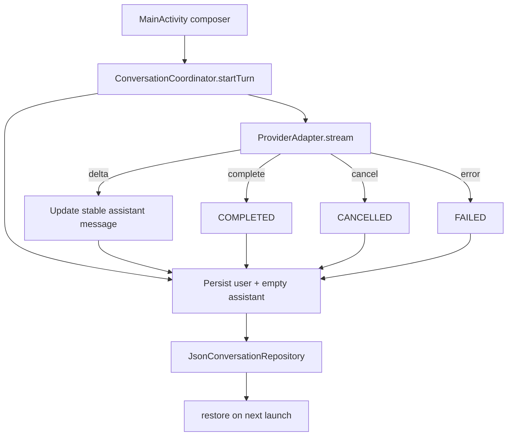

# Independent prototype architecture

## Purpose and boundary

`05-independent-prototype` is an original Android comparison client. It does not import MoCHi, the official ChatGPT APK, the official app’s backend protocol, or any real provider credential. Its provider is deterministic and local.

Package: `com.example.androidfeasibility`  
App label: `Local Stream Lab`

## Components

| Component | Responsibility |
|---|---|
| `ProviderAdapter` | Small provider-neutral stream/cancellation boundary |
| `MockProvider` | Deterministic normal, slow, empty, failure, and duplicate-terminal scenarios |
| `ConversationCoordinator` | Stable IDs, turn state machine, event ordering, cancellation, terminal guards, persistence |
| `ConversationRepository` | Persistence abstraction |
| `JsonConversationRepository` | Local JSON storage with temporary-file replacement |
| `MainActivity` | Standard Android Views, scenario selection, composer, send/stop, stable row updates |
| `PrototypeCoreTest` | Pure-Java tests for core behavior and deterministic mock completion |

## State model

The coordinator uses `IDLE`, `STARTING`, `STREAMING`, `COMPLETED`, `CANCELLED`, and `FAILED`. Each turn has stable conversation, turn, user-message, and assistant-message IDs. Deltas update the existing assistant message instead of creating a new message for every token.

Terminal handling is idempotent. Once a turn is terminal, late deltas and duplicate terminal events are ignored. Persisted `STREAMING` turns are marked failed on restore because this prototype has no background stream service; this is an explicit lifecycle policy rather than an assumption that a process restart can resume the provider.

## UI behavior

`MainActivity` uses standard Android Views. It keeps a `Map<messageId, TextView>` so stream deltas update stable rows. It only auto-scrolls when the user is already near the bottom. The screen exposes a scenario spinner, composer, Send, Stop, status text, and message list.

The UI does not attempt to imitate proprietary Valdi rendering. Its purpose is to test the client-side control/data flow independently: prompt → user row → streaming assistant row → terminal state → persisted restoration.

## Build and signing

The prototype was built with local JDK/Android SDK tools using `scripts/build-prototype.ps1`; no Gradle dependency graph is required. The APK is signed with a local prototype certificate:

- APK: `05-independent-prototype/build-output/local-stream-lab.apk`
- SHA-256: `D7E6A599AB885224C8D1ADD5DEB3AF29A771E438284C29D78B307B9E7F3DE51C`
- Certificate SHA-256: `a5367dc58009688205046fb8309b85906af5728b35858211e7f170534cd5b1f1`

## What this validates

The prototype validates that the most important client behaviors can be implemented without the official renderer or backend: incremental text, stable identity, cancellation, failure after partial content, duplicate-terminal protection, local persistence, restoration, and emulator execution.

It does not validate real provider protocol compatibility, production authentication, attachments, voice, markdown/tool rendering, encryption, or MoCHi integration.
