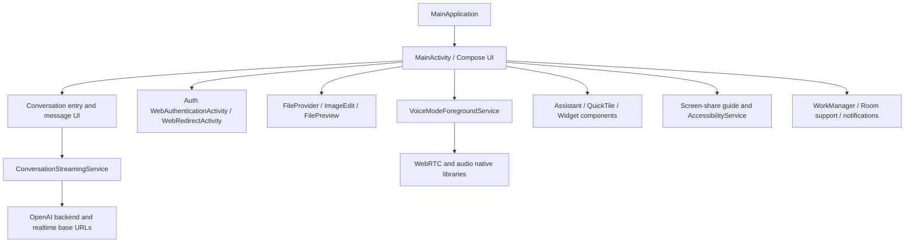

# Phase 2 — Static Analysis

## Evidence set

- Original archive and extracted 37-APK bundle: `01-original-apks/`
- Apktool 3.0.3 output: `04-apktool-output/chatgpt-1.2026.230-2623031/`
- Complete JADX fallback output: `03-jadx-output/chatgpt-1.2026.230-2623031-fallback/`
- Partial readable JADX output: `03-jadx-output/chatgpt-1.2026.230-2623031-nodeobf/`
- Reproducible scripts: `scripts/inventory-apk-bundle.ps1` and `scripts/collect-static-evidence.ps1`

## Package and manifest

Confirmed from AAPT and Apktool:

- Package: `com.openai.chatgpt`
- Version: `1.2026.230`
- Version code: `2623031`
- Compile SDK: 37 / Android 17
- Min SDK: 32 / Android 12L
- Target SDK: 37 / Android 17
- Application class: `com.openai.chatgpt.app.MainApplication`
- Launcher activity: `com.openai.chatgpt.MainActivity`
- Manifest: `allowBackup=false`, `extractNativeLibs=false`, resizeable activity enabled

The decoded manifest declares 30 permissions and optional camera/microphone features. Camera, microphone, location, notification, foreground-service, media-projection, biometric, NFC, billing, Firebase, WorkManager, and install-referrer capabilities are present. These declarations do not prove that each capability is exercised in every session.

## Component architecture

The named OpenAI components show a feature-oriented Android shell around a large obfuscated/compiled implementation:

The component names and manifest edges are confirmed. The exact dependency injection graph and method-level data flow are inferred because many implementation classes are obfuscated and the normal decompiler reports control-flow/type-inference failures.

## Network and streaming evidence

`defpackage/abe.java` in the fallback decode embeds these base URLs:

- `https://chatgpt.com/`
- `https://android.chat.openai.com/backend-api/`
- `https://android.chat.openai.com/backend-anon/`
- `https://android.chat.openai.com/public-api/`
- `https://android.chat.openai.com/realtime/`
- `https://api.openai.com`
- `https://auth.openai.com/`
- telemetry/RUM endpoints under `android.chat.openai.com` and `aw.api.openai.com`

The manifest and class inventory also include `ConversationStreamingService`. Its decoded fallback source logs lifecycle/start events and schedules a delayed handler for 1,200,000 ms. This confirms a foreground/background service boundary associated with conversation streaming, but not the exact HTTP/SSE/WebSocket implementation. No authenticated response stream was captured.

## UI, composer, and content handling

`MainActivity` handles `SEND`, `SEND_MULTIPLE`, `PROCESS_TEXT`, `VIEW`, and `EDIT` intents and passes eligible intents to a conversation-entry binding. The manifest exposes `ImageEditActivity`, `FilePreviewActivity`, a `ChatFileProvider`, and a glyph/file provider. This confirms intent-based sharing and file-preview/edit plumbing statically.

The resource strings contain composer, temporary-chat, history, attachment, image, file, voice, and reasoning UI copy. The decoded runtime hierarchy observed a `ComposeView` and the main screen’s semantics exposed `Ask ChatGPT`, `Attachment`, `Dictation`, and `Send Message` content descriptions.

## Voice, media, and screen context

Confirmed static signals:

- `RECORD_AUDIO`, `FOREGROUND_SERVICE_MICROPHONE`, `MODIFY_AUDIO_SETTINGS`
- `com.openai.voice.webrtc.VoiceModeForegroundService`
- `com.openai.feature.voice.impl.quicktile.QuickTileService`
- `VoiceAudioRecordingUploadWorker`
- `ConversationScreenAccessibilityService`
- `ConversationScreenShareSettingsGuideActivity`
- `DETECT_SCREEN_CAPTURE` and `FOREGROUND_SERVICE_MEDIA_PROJECTION`
- x86_64 native `liblkjingle_peerconnection_so.so` and OpenAI cross-platform export library

The accessibility service source explicitly obtains accessibility windows and, on API 34+, calls `takeScreenshotOfWindow`, wraps the hardware buffer into an ARGB bitmap, and logs capture failures. This is code evidence, not proof that the service was enabled or used in the emulator.

## Storage, history, and background work

The manifest contains AndroidX Room’s `MultiInstanceInvalidationService`, WorkManager system services, notification workers, and multiple paging-source classes. Resources include copy for history, temporary chats, memory, file retention, and conversation search. These facts support the presence of local/background data plumbing. The exact database schema, cache keys, encryption, and synchronization protocol remain unconfirmed because no logged-in account data was created.

## Native library inventory

The selected x86_64 split contains 10 native libraries. Hashes are preserved in `05-native-libraries/native-library-sha256.txt`. The most application-relevant names are `libopenai_xplat_export.so`, `liblkjingle_peerconnection_so.so`, `libimage_processing_util_jni.so`, and Sentry libraries. Native symbol-level behavior was not reverse engineered in this phase.
